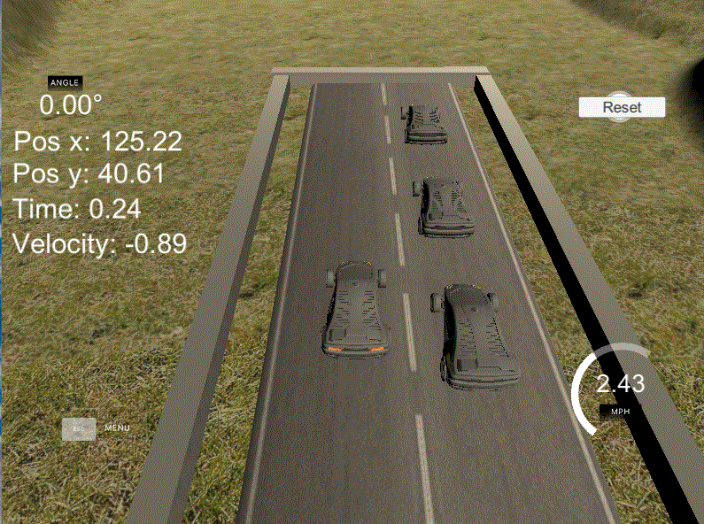

# Overview

Welcome to this quick and straightforward project that aims to help you become familiar with the workspaces used in the Introduction to Autonomous Cars Nanodegree program. The project is designed to provide hands-on coding experience to control a simulated car. Although there are three parts, only Part Three requires submission.

## Part One - Drag Race

In this part, you'll develop code enabling a car to leap over a cluster of trees. While this scenario may not directly mirror real-world self-driving conditions, it serves as a valuable introduction to the programming interface.

## Part Two - Circular Track

Here, your task involves crafting code to guide a car along a circular track. This exercise offers insights into the correlation between steering angle and turning radius, a fundamental concept in autonomous vehicle control.

## Part Three - Parallel Park

The highlight of this project, Part Three demands the creation of a sequence of instructions for successfully executing a parallel parking maneuver. Unlike real-world situations where repeated attempts might lead to collisions, this project allows you to iterate as needed without consequences. So, feel free to refine your parking skills until perfection is achieved!

## Project Rubric

The code for the submission can be found in the file [ParallelParking.ipynb](./ParallelParking.ipynb), in particular, in the `control` function. The idea is to define the throttle position values and steering angle so that the vehicle parks in the parking space correctly, without hitting other parked vehicles. To help define these values, users can use the WASD keys to park the vehicle and observe them and then set them to function.

## Result

In this sense, the code cell below shows the defined values. When starting the simulation, the car will reverse until the time reaches 0.6 seconds. When `pos_y` is greater than 35.4, the vehicle will roll to the right, enter the space, and, in the third condition, to the left to align the vehicle. Finally, the steering will return to its normal position, the accelerator will be set to 0 and the brake will be set to 1.

```python
if time < 0.6:
        # Step 1: Drive forward for 0.6 seconds
        car_parameters['throttle'] = -1
elif pos_y > 35.4:
    # Step 2: Back up while turning the steering wheel to the right
    car_parameters['throttle'] = -1
    car_parameters['steer'] = 25
elif pos_y > 31.9 and pos_x < 129.2:
    # Step 3: Back up while turning the steering wheel to the left
    car_parameters['throttle'] = -1
    car_parameters['steer'] = -25    
else:
    # Step 4: Stop the car by applying brakes
    car_parameters['steer'] = 0
    car_parameters['throttle'] = 0
    car_parameters['brake'] = 1
```

The GIF below shows the result obtained with the execution of the code.



## Refereces

[Introduction to Self-Driving Cars NanoDegree](https://learn.udacity.com/nanodegrees/nd113)